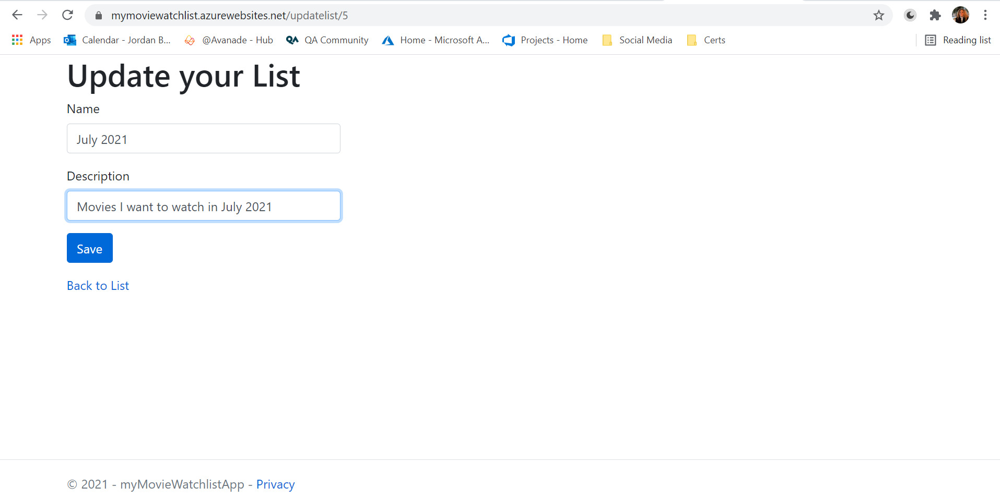

# myMovieWatchlist
This is my implementation of a CRUD application. With this web application a user creates a list item and within a list item a user then creates a movie item, that is associated with the list. All items and their data is readable, editable and deletable.

# Table of Contents
1. [Technologies Used](#technologiesused)
2. [Development](#development)
    
    2.1 [Requirements](#requirements)
    
    2.2 [User Stories](#userstories)

    2.3 [Trello Board](#trelloboard)
3. [Architecture](#architecture)

    3.1 [Database](#database)
    * Entity Relationship Diagram 
    * Current Live Database

    3.2 [CI Pipeline](#ci)
4. [Risk Assesment](#risk)
5. [Testing](#test)
6. [Front-End](#frontend)
7. [Issues and Improvements](#issues)

## Technologies Used 
This application is a ASP.NET Core MVC Web Applcation with an Azure Database, deployed on Azure App Services.
* ASP.NET
* C#
* Git
* Azure MySQL Database
* Azure App Service
* Azure DevOps
* Trello

## Development 

### Requirements 
* List Item
    * Create List
    * View Lists
    * Edit List
    * Delete List
    * Add Movie to List
* Movie Item 
    * Create Movie
    * View Movies in List
    * Edit Movie
    * Delete Movie
### User Stories 
* As a movie watcher, I want to be able to add movies to my movie watchlist, so that I can always have something to watch.

* As a movie watcher, I want to be able to edit or delete a movie I added to my movie watchlist, so that if I make any mistakes or change my mind it doesn't require much effort.

* As a movie watcher, I want to know if I have watched a movie or not, so that I can remember all the movies I want to watch and can look back on what I have already watched.

* As a user, I want a clean interface with no fuss, so that I can quickly and easily add/delete/edit/look at all the movies I have watched and want to watch.

### Trello Board 

## Architecture 
### Database 
#### Entity Relationship Diagram
The database changed once throughout development - with the addition of Year in Movie and the changing of typr for DateAdded to string from DateTime. There existsed a many-to-many relationship between list and movie so a third database was need in order to normalise the database. The MovieList table relates the two tables wihtout them relating to eachother.

#### Current Live Database
##### Lists

##### Movies
Through development the DateAdded attribute was changed from a DateTime to a string for displaying purposes.

##### MovieLists

### CI Pipeline 
This was the aimed CI Pipeline implementation and nearly every aspect was a success, failing at the publish cycle in Azure Pipelines.

Unfortunately after publishing through Azure pipelines there is an error:

So I had to Publish through the Visual Studio publisher. 

## Risk Assesment 

## Testing 
All controllers and models were tested using xUnit testing with a code coverage report generated by the extension Fine Code Coverage.

The testing of the models included:
* Null test
* Attribute tests
* Constructor test

The testing of the controllers included:
* Repositroy Patterns
* Mocking using Moq
* Controller Tests
* Null Test for each Function

Testing revealed issues I had in my code with poor exception handling. I fixed the issues with some simple conditional statements. 

## Front-End 
When accessing the WebApp, the user is brought to the homepage that introduces the List CRUD functionailty. From the hompage, providing a list has been created, the user can navigate to the list page where all movies associated with the list are displayed.
### Homepage

### Create a List Page

### Homepage Showing New List

### Update List Page

### Homepage With Updated List

### Deleted List

### List Page 
Accessed through clicking a list on the homepage.

### Create a Movie Page

### List Page with Added Movie

### Update Movie Page

### Updated Movie

### Deleted Movie

## Issues and Improvements 
### Issues
Issues I see:
* Not Publish Through Pipelines: As I couldn't get publishing through pipelines to work, there could be some long term CI/CD issues.
* Back Button Functionality: When using Chrome back buttons, after a delete for example, the same page is re-loaded making for a poor user experience. I added functioning back buttons to each page as a quick-fix but would like to work on a more robust solution.
* Redundant Data in Database: When adding movies there is no check to see if the movie added, already exists. While this is not a threat to the WebApp it is not the most ideal solution.

### Improvements
I would like to improve:
* The UI: Add some more unique features and styling ad it is currently quite basic.
* The Input: Ideally I would like to have the input areas as a partial view within the same page so the user isn't navigating between seperate pages.
* Edit of Movies: I would like to make the movie item editable within the movie view page, with the watched attribute like a radio button immitating a checklist.
* Add Publish Through Azure Pipelines.

### Additional Features
I would like to add:
* All Movie Feature: At the moment movies are only viewable within a list. I would like to add functionality to see all of the users added movies in one view.
    * This would reveal additional issues with how movies are added to the database, as a movie is added without checking if that movie item already exists. That would need to be updated.
* Add Movie Information: It would be nice to have each movie to have a movie page, like the likes of IMDB, with photo, actor and director information.
* A lot more Styling: I would like to add a lot more styling to the page.
* Accounts: Ideally the WebApp would work best with each using having their own account as to have their own database. 